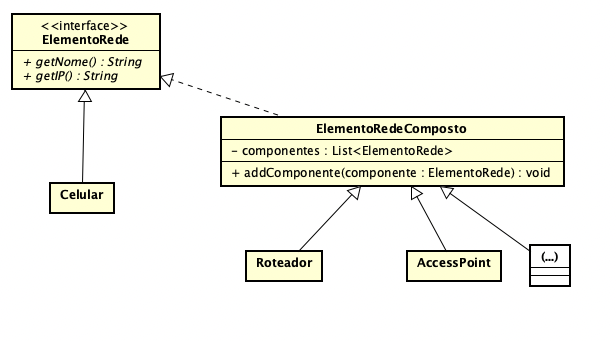

**Universidade Federal da Paraíba - UFPB** \
**Centro de Ciências Exatas e Educação - CCAE** \
**Departamento de Ciências Exatas - DCX**

**Professor:** [Rodrigo Rebouças de Almeida](http://rodrigor.dcx.ufpb.br)

# Atividade 09

* Implemente a composição entre elementos de rede de computadores, de acordo com o diagrama abaixo.
* Os testes unitários devem passar.
* Utilize o padrão Composite na implementação da solução.

